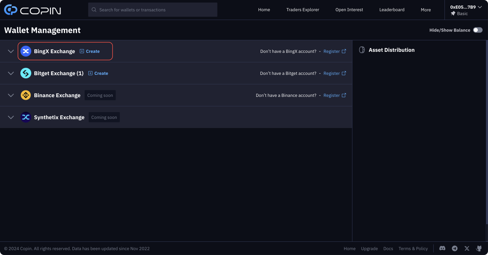

# Connect BingX API


Register a BingX account: [https://bingx.com/en-us/invite/DY5QNN](https://bingx.com/en-us/invite/DY5QNN)


Click on your wallet in the top right-hand corner of the screen and go to the "Wallet Management" tab or visit [https://app.copin.io/wallet-management](https://app.copin.io/wallet-management)

<figure><figcaption></figcaption></figure>

Click "Create" at " BingX Exchange" to start linking your BingX account to app.copin.io through API key.

<figure><figcaption></figcaption></figure>

The connection process involves:

<table data-header-hidden><thead><tr><th width="248"></th><th></th></tr></thead><tbody><tr><td><strong>BingX Account Setup</strong></td><td>Create an account, unless you already have one.</td></tr><tr><td><strong>2FA Activation</strong></td><td>Enhance security by enabling two-factor authentication.</td></tr><tr><td><strong>API Key Creation</strong></td><td>Generate an API key for Copin Analyzer integration.</td></tr><tr><td><strong>Fund Deposit and Transfer</strong></td><td>Deposit funds into BingX and transfer them to your <strong>perpetual future</strong> <strong>USDT-M</strong> account.</td></tr></tbody></table>

> _For any difficulties, we invite you to join_ [_the Copin.io community_](https://t.me/Copin\_io) _where our admin team is ready to assist._

### **1. BingX Account Setup**

#### **Step 1: Website Visit and Register**

* Go to the [BingX website](https://bingx.com/invite/DY5QNN)
* Click \[Register] in the top right corner.

<figure><figcaption>
<a href="https://bingx.com/invite/DY5QNN">https://bingx.com/invite/DY5QNN</a>
</figcaption></figure>

#### **Step 2: Account Registration**

* Opt to register with either your email or phone number, set your password

#### **Step 3: Security Verification**

* Complete the puzzle for security verification and enter the verification code sent to your email or phone number to finalize registration.
* Slide right to complete the security verification puzzle. Finally, fill in the verification code received by the email or phone number you used to sign up. Your sign-up will then be completed successfully.

### 2. **2FA Activation**


_Two-factor authentication (2FA) is a security method that requires you to enter a dynamic verification code generated on your mobile phone to perform operations such as login and transfer. Before using 2FA, you'll need to bind the authenticator. This security measure provides better protection for your account information and funds._


#### **Step 1: Access Settings**

* Log into the [BingX website](https://bingx.com/invite/DY5QNN), click the avatar icon
* Select \[Account & Security] from the dropdown menu under the avatar icon.

<figure><figcaption></figcaption></figure>

#### **Step 2: Enable Google Verification**

* Scroll down to the \[Security Center] section and you'll see \[Google Verification].
* Click the \[Link] button.

<figure><figcaption></figcaption></figure>

#### **Step 3: Install Google Authenticator**

* Scan the QR code that corresponds to your mobile phone's operating system (iOS/Android) to download Google Authenticator
* You can also download and install it directly from the app store.

<figure><figcaption></figcaption></figure>

#### **Step 4: Setup an Authenticator**

* Open Google Authenticator, tap the "+" sign
* Scan the webpage's QR code or enter the provided BingX key manually by selecting "Enter a setup key".

<figure><figcaption></figcaption></figure>

#### **Step 5: Complete Verification**

* Solve the verification puzzle, enter the codes from your email and Google Authenticator
* Click \[Submit] to finish the binding process.

<figure><figcaption></figcaption></figure>

### 3. **Generate an API key**

#### **Step 1: API Settings**

* Visit [https://bingx.com/en-us/account/api/](https://bingx.com/en-us/account/api/)

<figure><figcaption></figcaption></figure>

* Click \[Create API]

<figure><figcaption></figcaption></figure>

#### **Step 2: API Naming**

* Choose a simple, memorable name for easy identification.

<figure><figcaption></figcaption></figure>

#### **Step 3: Security Confirmation**

* Confirm your security settings before proceeding.

<figure><figcaption></figcaption></figure>

#### **Step 4: Modify API Info**

* Click \[Edit] to adjust API details.

#### **Step 5: Select Permissions**

* Ensure only 'Read' and 'Perpetual Futures Trading' are selected, and set to 'Unrestricted'.

<figure><figcaption></figcaption></figure>

#### **Step 6: Important**

* The Secret Key is displayed only once. It will be hidden after a page refresh or closure. Securely store it!

#### **Step 7: Final Security Confirmation**

* Complete the process with a final security verification

### **4. Fund Deposit and Transfer**

To transfer funds to your Perpetual Fund Account after depositing into your Fund Account, follow these steps:

* **Step 1: Head to the \[My Assets]** [**page**](https://bingx.com/en-us/assets/) **and click \[Transfer].**

<figure><figcaption></figcaption></figure>

#### **Step 2: Verify \[From] as your current fund, and \[To] as the Perpetual Futures Account.**

#### **Step 3: Input the USDT amount into \[Amount].**

#### **Step 4: Click \[Confirm] to complete the process.**

<figure><figcaption></figcaption></figure>

After transferring funds to your Perpetual Futures Account on BingX, you are ready to begin the process of copy trading on Copin and leverage investment strategies from experienced traders.
