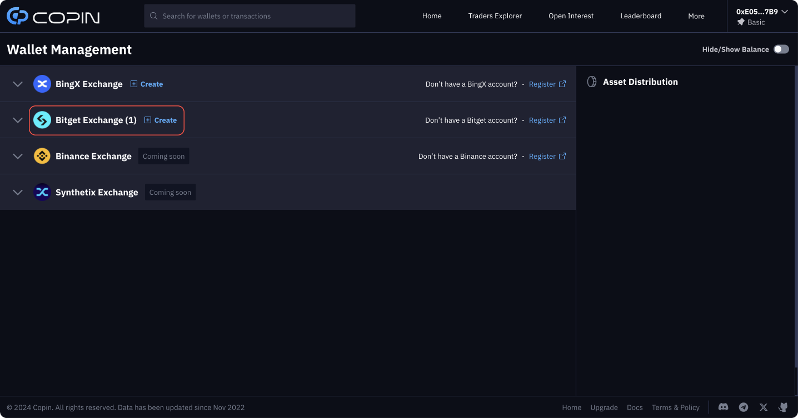

# Connect Bitget API


Register a Bitget account: [https://partner.bitget.online/bg/HPM3BN](https://partner.bitget.online/bg/HPM3BN) (Referral code: **`1qlg`**)


Click on your wallet in the top right-hand corner of the screen and go to the "Wallet Management" tab or visit [https://app.copin.io/wallet-management](https://app.copin.io/wallet-management)

<figure><figcaption></figcaption></figure>

Click "Create" at " Bitget Exchange" to start linking your Bitget Exchange account to app.copin.io through API key.

<figure><figcaption></figcaption></figure>

The connection process involves:

| **Bitget Account Setup**                          | Create an account, unless you already have one.                                                   |
| ------------------------------------------------- | ------------------------------------------------------------------------------------------------- |
| 
<strong>Identify Verification</strong> 
 | Identity Verification or Know Your Customer (KYC) standards are required for all users of Bitget. |
| **API Key Creation**                              | Generate an API key for Copin Analyzer integration.                                               |
| **Fund Deposit and Transfer**                     | Deposit funds into Bitget and transfer them to your **future** account.                           |

> _For any difficulties, we invite you to join the_ [_Copin.io community_](https://t.me/copin\_io) _where our admin team is ready to assist._

### **1. Bitget Account Setup**

**Step 1: Sign up for a Bitget account.**

* To create a new account on Bitget, you must first visit the [Bitget website](https://partner.bitget.online/bg/HPM3BN).
* Then click on the "Sign up" button to get started.

**Step 2: Account Registration**

* You can choose to register either with your email address or your telephone number
* Enter a secure password
* Use the referral code **1qlg** for initial account benefits.
* Accept the User Agreement and Privacy Policy
* Click on "Create Account"

<figure><figcaption></figcaption></figure>

**Step 3: Confirm your account**

* After submitting the registration form, you will be asked to verify your account. Bitget will send a verification email containing a confirmation link.
* Click on this link to activate your account.

### **2. Identify Verification**

**Step 1: Access the Identity Verification Page**

* Click on your profile in the top right-hand corner of the screen and go to the "Identify Verification" tab or visit https://www.bitget.online/verified/enter

<figure><figcaption></figcaption></figure>

* Then click on "Verify" to perform Level 1 verification.

<figure><figcaption></figcaption></figure>

**Step 2: Complete KYC**

* Fill in your personal details, such as country/region, first name, last name and provide an official identity document such as ID card or driver's license.

<figure><figcaption></figcaption></figure>

* Once you've provided this information, take a photo of both sides of your identity document and take a selfie using either your webcam or your Bitget mobile application. Avoid wearing glasses or a hat, and make sure you are exposed to good light.

<figure><figcaption></figcaption></figure>

* After submitting your selfie, you will receive a notification that your KYC verification information has been successfully submitted.

<figure><figcaption></figcaption></figure>

### **3. API Key Creation**

**Step 1: Access the API keys page**

* Click on your profile in the top right-hand corner of the screen and go to the "API keys" tab or visit https://www.bitget.online/account/newapi

<figure><figcaption></figcaption></figure>

* Read and agree to Bitget's API Keys Terms & Conditions

<figure><figcaption></figcaption></figure>

**Step 2: Create API Key**

* Click "**Create API Key**"

<figure><figcaption></figcaption></figure>

* Click "**System-generated**"

<figure><figcaption></figcaption></figure>

**Step 3: Modify API Info**

* Choose a simple, memorable note for easy identification.
* Create "Passphrase (API token)" API
* Select "Read-write"

<figure><figcaption></figcaption></figure>

* Ensure only "**Orders**", "**Holdings**" and "**Trade**" are selected.

<figure><figcaption></figcaption></figure>

**Step 4: Final Security Confirmation**

* Complete the process with a final security verification then "Confirm".

<figure><figcaption></figcaption></figure>

* The Access APIKey and SecretKey are displayed, so let's copy and fill in[ Copin Wallet Management](https://app.copin.io/wallet-management)

<figure><figcaption></figcaption></figure>

**Step 5: Complete creating Bitget Wallet on Copin.io**

* Access https://app.copin.io/wallet-management
* Fill Bitget API Key, Secret Key and Pass Phrase you just created in the previous step.

<figure><figcaption></figcaption></figure>

### **4. Fund Deposit and Transfer**

**Step 1: Make a deposit on Bitget**

* Before you start copy trading, you'll need to make a deposit into your BITGET account. You can choose between several methods for depositing money into your account: cryptocurrency deposit, credit/debit card, P2P, Third Party or bank transfer.
* Depending on the method you choose, Bitget will give you the steps to follow to make your deposit.

**Step 2: Transfer funds to Futures account**

* Head to the **"**[**Assets Overview**](https://www.bitget.online/asset)**".**

<figure><figcaption></figcaption></figure>

* Click "**Transfer**"

<figure><figcaption></figcaption></figure>

* Input the USDT amount into "Transfer Amount" then Confirm

<figure><figcaption></figcaption></figure>

After transferring funds to your Futures Account on Bitget, you are ready to begin the process of copy trading on Copin.io.

### FAQ

#### _Q1: Why have I created API Keys and connected Bitget's API with_ [_Copin.io_](http://copin.io/) _in Wallet Management but still can't copy trades?_ &#x20;

A: Check if you have granted the necessary permissions when creating the API Key, select 'Read-Write', 'Orders', 'Holdings', and 'Trades'. Then, make sure you have transferred funds to your Futures account. &#x20;

#### _Q2: Which type of API Key should I choose when creating API keys?_ &#x20;

A: Choose '**System-generated API key**'. &#x20;

#### _Q3: What should the balance ratio be in the Bitget Futures account with Margin when setting up copy trades using the Bitget Wallet on_ [_app.copin.io_](http://app.copin.io/)_?_ &#x20;

A: Always set up copy trades (Margin) with an amount smaller than the balance in your Bitget Futures account to ensure orders are executed. For example: If the balance in your Futures account is $3000, you should set up copy trades with Margin < $3000. &#x20;

#### _Q4: How should I fill in the IP address section?_ &#x20;

A: You don't need to fill in anything and can skip this section to proceed.
