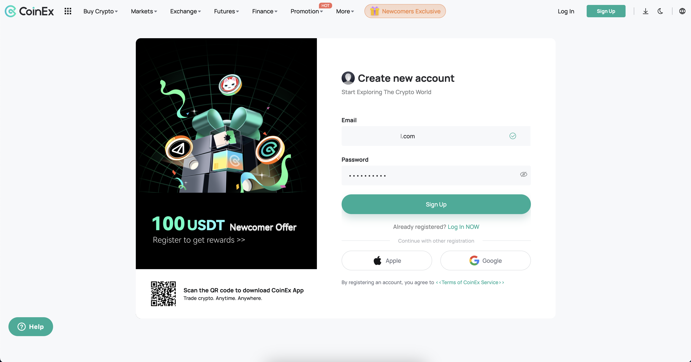
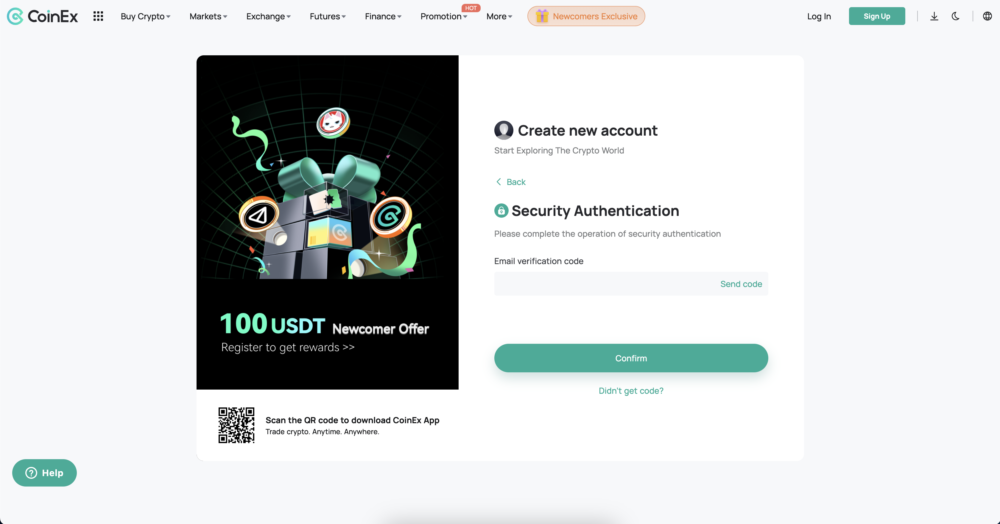

# Connect CoinEX API

Link with your CoinEx account through API key. All your assets and your positions are managed by CoinEx.


Register a CoinEx account: [https://www.coinex.com/register?refer\_code=npy4q](https://www.coinex.com/register?refer\_code=npy4q) (Referral code: **`npy4q`**)


The connection process involves:

<table data-header-hidden><thead><tr><th width="258"></th><th></th></tr></thead><tbody><tr><td><strong>CoinEx Account Setup</strong></td><td>Create an account, unless you already have one.</td></tr><tr><td><strong>Identify Verification</strong></td><td>Identify Verification or <strong>Know Your Customer</strong> (KYC) standards are required for all users of CoinEx.</td></tr><tr><td><strong>API Key Creation</strong></td><td>Generate an <strong>API key</strong> for Copin Analyzer integration.</td></tr><tr><td><strong>Fund Deposit and Transfer</strong></td><td>Deposit funds into CoinEx and transfer them to your <strong>Futures</strong></td></tr></tbody></table>

> _For any difficulties, we invite you to join_ [_the Copin.io community_ ](https://t.me/Copin\_io)_where our admin team is ready to assist._

## 1. Create a CoinEx account

* Visit the website: [https://www.coinex.com/register?refer\_code=npy4q](https://www.coinex.com/register?refer\_code=npy4q)
* Fill in and select all required information:
  * Email or phone number
  * Password (Note: The password must be 8-20 characters and include both numbers and letters)
  * Use the referral code: **npy4q**. (This step cannot be changed; make sure you use the correct Copin referral code to receive exclusive benefits from Copin)
* Select "Sign Up" to complete the account registration.

<figure><figcaption></figcaption></figure>

* The system will take you to a new page to enter the 6-digit verification code sent to your registered phone number or email.

<figure><figcaption></figcaption></figure>

## 2. Identity Verification

KYC stands for Know Your Customer, which refers to verifying or assessing a customer’s identity. KYC aims to promote Anti-Money Laundering (AML) efforts and protect against financial fraud and identity theft.

You can refer to CoinEx’s detailed guide here: [https://www.coinex.com/vi/help/sections/articles/900004309243](https://www.coinex.com/vi/help/sections/articles/900004309243)

## 3. 2FA Security

Two-Factor Authentication (2FA) is a security method that requires you to enter a verification code generated on your mobile device to perform actions such as logging in and transferring funds. Linking your account with Google Authenticator can enhance security and reduce potential risks to your account.

You can refer to CoinEx’s detailed guide here: [https://www.coinex.com/en/help/sections/articles/360025231153](https://www.coinex.com/en/help/sections/articles/360025231153)

## 4. Deposits and Fund Transfer

### a. Deposits

Before starting copy trading, you need to deposit funds into your CoinEx account. CoinEx will provide you with specific steps to deposit crypto to CoinEx.&#x20;

[https://www.coinex.com/en/help/sections/articles/900004353543](https://www.coinex.com/en/help/sections/articles/900004353543)

### b. Fund Transfers

Go to Asset Overview.

* Click on "Transfer."
* Enter the amount of USDT in "Amount" and confirm.

<figure><figcaption></figcaption></figure>

After transferring funds to the Futures on CoinEx, you’re ready to start copy trading on Copin.io.

## 5. Create API&#x20;

### Step 1: Access the API&#x20;

Click on your profile in the top-right corner of the screen and go to the API Management tab, or visit [https://www.coinex.com/en/apikey](https://www.coinex.com/en/apikey)\

<figure><figcaption></figcaption></figure>

### Step 2: Create an API Key

Click on "Create API"\

<figure><figcaption></figcaption></figure>

### Step 3: Fill in the information

* Name your API in the "API Note" section
* Leave the IP Address field blank
* Select "Tradable" under permissions
* Click "Create"

<figure><figcaption></figcaption></figure>

### Step 4: Confirmation

* Complete the process with security verification, then Confirm.

<figure><figcaption></figcaption></figure>

* The Access API Key and Secret Key will be displayed after creation.

<figure><figcaption></figcaption></figure>

Note: The API will only display full information about the Secret Key once. Make sure to save it before closing the API creation window.

## 6. Complete creating CoinEx wallet on Copin

* Click on your wallet in the top right-hand corner of the screen and go to the "**Wallet Management**" tab or visit [https://app.copin.io/wallet-management](https://app.copin.io/wallet-management)

<figure><figcaption></figcaption></figure>

* Click "**Create**" at " **CoinEx Exchange**" to start linking your CoinEx account to app.copin.io through API key.

<figure><figcaption></figcaption></figure>

* Fill in the API Key, Secret Key and Pass Phrase you just created in the previous step.

<figure><figcaption></figcaption></figure>

**To summarize, follow these steps to connect your CoinEx account to the app:**

1. Create an API key in your CoinEx account.
2. Enter the API Key, Secret Key, and Pass Phrase into the copin.io application to complete the link setup.


If you encounter any issues, feel free to [contact us on Telegram](https://t.me/leecopin) or [join our community](https://t.me/Copin\_io).


