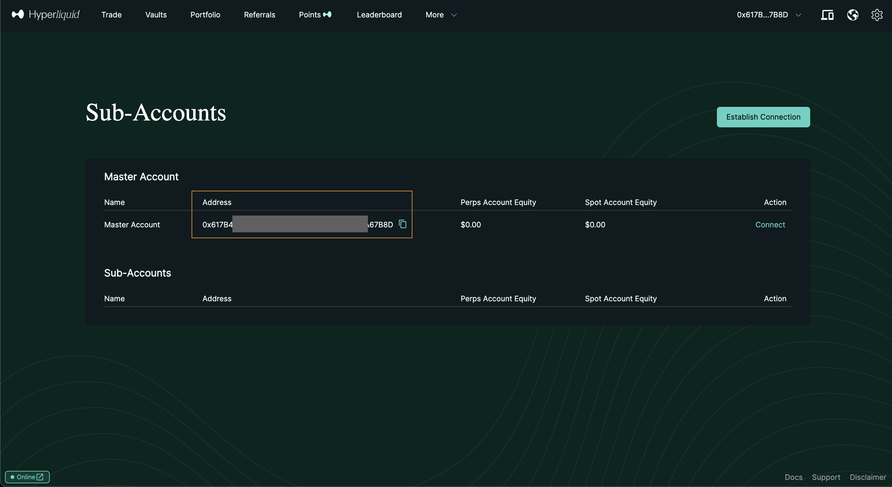

# Connect Hyperliquid API


#### Prerequisites for Hyperliquid and Copin

1. **Matching Wallet Addresses**: It's recommended to log into Hyperliquid with the same wallet address you use for Copin to avoid potential errors.
2. **Create a Hyperliquid Account**: If you don't have an account yet, [register here ](https://app.hyperliquid.xyz/join/COPIN)(Referral code: COPIN)
3. API wallets (also known as agent wallets) can perform actions on behalf of your account without having withdrawal permissions. You must still use your account's public address for info requests.


## Step 1: Create a Hyperliquid API

1. Visit the Hyperliquid API page: [https://app.hyperliquid.xyz/API](https://app.hyperliquid.xyz/API) and connect your wallet.
2. Complete the API Details:

* Name: Choose a name, e.g., `Copin_Copytrade`.
* Generate a Wallet Address: Click **\[Generate]**.
* Authorize the API Wallet: Click **\[Authorize API Wallet]**.

<figure><figcaption></figcaption></figure>

3. Save Your Private Key:

* Set Maximum Validity: Choose MAX for up to 180 days.
* Click **\[Authorize]** to complete.

<figure><figcaption></figcaption></figure>

## Step 2: Connect API to Copin

1. Visit Copin Wallet Management: [https://app.copin.io/wallet-management](https://app.copin.io/wallet-management) and log in.
2. Connect to Hyperliquid Exchange: Select **\[Connect]** Hyperliquid Exchange.

<figure><figcaption></figcaption></figure>

3. Enter API Details:

* Hyperliquid Account Address: This is the Master Account wallet on Hyperliquid. [Find the Master Account wallet](https://app.hyperliquid.xyz/subAccounts).
* API Wallet Private Key: The private key saved from API creation.
* Wallet Name: Optional.

<figure><figcaption>
This is your master account
</figcaption></figure>

<figure><figcaption></figcaption></figure>

4. Agreement and Confirmation:

* Check I agree to allow Copin to use the API for placing orders. A 0.025% fee applies per copy trade.
* Verify your wallet is the Master Account on Hyperliquid before confirming.

<figure><figcaption></figcaption></figure>

## FAQs

**1. Why am I getting the error "Can't approve builder fee Hyperliquid"?**

This error appears if the wallet used to connect the API to Copin is not the Master Account on Hyperliquid. To fix it:

* Verify that you are using the correct Master Account wallet by visiting [Hyperliquid’s SubAccounts page](https://app.hyperliquid.xyz/subAccounts).
* Ensure this Master Account wallet is entered and used to sign the connection to Copin.

**2. Why wasn’t my order executed?**

Orders may fail if the wrong wallet was used to sign the API connection. Double-check that the correct Master Account wallet is used for signing and connected properly to avoid any missed API calls.

**3. Can I manually close my copy position on Copin?**

Currently, you cannot manually close copy trade orders on Copin. To close a position, do so directly on Hyperliquid. Afterward, go to [Copin Wallet Management](https://app.copin.io/me/management), select your Hyperliquid wallet, and **Unlink** the closed position to prevent errors.

**4. Why is there a discrepancy in leverage for my copy trade order?**

Hyperliquid enforces different leverage limits for each trading pair. Copin uses the minimum leverage between your chosen setting and the maximum allowed by Hyperliquid for that pair.

* Example: For a WIF/USD trade, if you set leverage at 20x but Hyperliquid allows only 5x, the trade will execute at 5x leverage.

**5. Why do I see a PnL discrepancy in the Copy Opening Position Detail?**

Copin uses the PYTH oracle to obtain price information, while Hyperliquid has its pricing system. This may cause temporary PnL discrepancies, but prices will sync when the order is closed, reflecting Hyperliquid’s final data.

**6. Why are there multiple entries in my activities log?**

Hyperliquid's system uses partial order matching, so each partial fill appears as a separate entry in the activity log, unlike other sources that may group these as a single copy order.


Join the Copin Global community on Telegram to get support here: [https://t.me/Copin\_io](https://t.me/Copin\_io).


