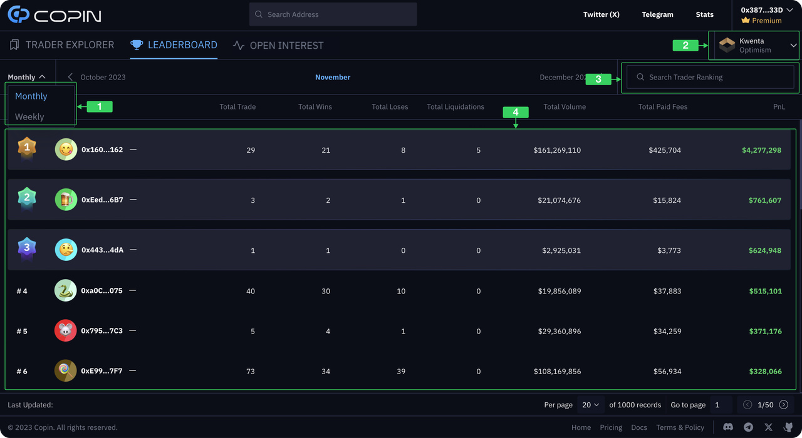

# DCP via gTrade (Gains Network)

To effectively use DCP (via gTrade), you need to understand at least three key aspects:

* Create an Account Abstraction Wallet
* Set Up Copy Trading
* Manage Copy Trading

## 1. How to Create an Account Abstraction Wallet?

Before creating an **Account abstraction** (AA) wallet, you need to prepare by first depositing some funds into your EVM wallet to cover the costs of creating the wallet and depositing funds into the AA wallet. For gTrade Exchange, you'll need:

* ETH (chain Arbitrum)
* USDC (chain Arbitrum)

**1.1 Log in Copin**\
( 1 ) Visit [https://app.copin.io/](https://app.copin.io/)

( 2 ) Select `Connect Wallet`

<figure><figcaption></figcaption></figure>

( 3 ) Choose any supported EVM wallet that Copin is compatible with. _(In this guide, I'll be using **MetaMask**)_

<figure><figcaption></figcaption></figure>

( 4 ) Select `Sign` to complete the login process for Copin DCP.

**1.2 Create AA Wallet**

( 1 ) Go to [https://app.copin.io/wallet-management](https://app.copin.io/wallet-management) to create an AA wallet.

( 2 ) Select `Create` next to gTrade Exchange.

<figure><figcaption></figcaption></figure>

( 3 ) Click `Confirm` to complete the setup. This process requires a fee of approximately _$0.05 in ETH_ on the Arbitrum network.

**1.3 Funding your AA Wallet**

( 1 ) Continue by selecting `Deposit` to add funds to the AA wallet you just created. Ensure that your EVM wallet has a sufficient balance of ETH and USDC on the Arbitrum network. **A minimum deposit of 60 USDC is required for a single copy trade position.**

<figure><figcaption></figcaption></figure>

( 2 ) Click `Approve` to confirm the balance with Copin. Complete authentication through MetaMask.

<figure><figcaption></figcaption></figure>

( 3 ) Enter the amount of USDC you wish to deposit into your AA wallet for copy trading. Click `Deposit` to proceed and `Confirm` to finalize.

<figure><figcaption></figcaption></figure>

## 2. How to Set Up Copy Trading?

Detailed information about copy trading settings can be found at: [https://docs.copin.io/features/copy-trading](https://docs.copin.io/features/copy-trading). However, please take note of a few changes:

( 1 ) Selecting the AA wallet you will use for copy trading.

<figure><figcaption></figcaption></figure>

( 2 ) A few important notes on fees:

* **Max Slippage: 0.5%**
* **Protocol Fee: 0.025% \* Trading Size**

## 3. How to Manage Copy Trading?

**3.1 Managing Copy Trades**\
Go to [https://app.copin.io/me/management](https://app.copin.io/me/management) to access the copy trade management page.

( 1 ) Where you will select the wallet used for copy trading.

( 2 ) Displays basic information such as balance, total trading volume, profit and loss (PnL), and the number of copies.

( 3 ) Displays copy trade settings for each trader you are copying. You can toggle the settings on and off at `Run` and adjust details via the `⋮` icon.

<figure><figcaption></figcaption></figure>

**3.2 Closing an Open Position**

( 1 ) If there is an open copy trade position, you can manually close it early by selecting the open position.

<figure><figcaption></figcaption></figure>

( 2 ) Next, click `Close`

<figure><figcaption></figcaption></figure>

( 3 ) Then click `Confirm` to manually close the copy trade position.

<figure><figcaption></figcaption></figure>

( 4 ) Confirm the notifications in MetaMask to complete the on-chain operation. Your position will then be closed manually.

**3.3 Checking History**

( 1 ) Go to [https://app.copin.io/me/history](https://app.copin.io/me/history) to view your copy trading history. All details about copy trade positions will be clearly displayed, including the time the order was created, when it was closed, the trader who executed the trade, and more.

<figure><figcaption></figcaption></figure>

( 2 ) By clicking on any order in the history, you can view more information for each specific copy trade position.

<figure><figcaption></figcaption></figure>

**3.4 Checking Activity**

Go to [https://app.copin.io/me/activity](https://app.copin.io/me/activity) to view notifications related to your copy trading activity. The main difference from the trade history page is that it shows content related to the execution of copy trades, such as the status of the trade and errors related to the failure to execute a copy trade position.

<figure><figcaption></figcaption></figure>


**Check stats on Dune:** [https://dune.com/copin/copin-dcp-gtrade](https://dune.com/copin/copin-dcp-gtrade)

