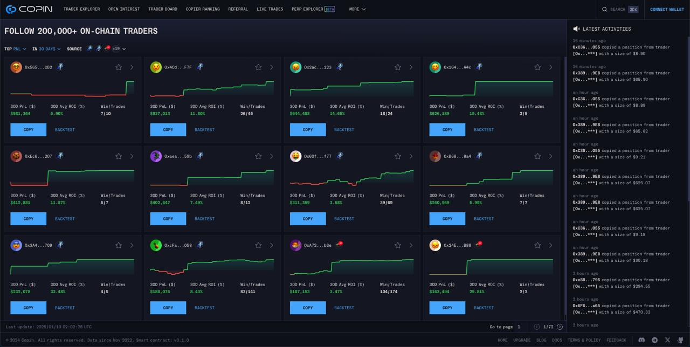

# Release notes

Copin - 1.1.1 (1/22/2024)

**1. Copin Alert v2.0.1**

\- Updated interface for a smoother experience, paving the way for users to flexibly and powerfully customize alerts in the future.

\- Start exploring now: [https://app.copin.io/settings/alert-list](https://app.copin.io/settings/alert-list)

**2. Copin Lite v0.2.0**

This update enhances usability and onboarding with the following improvements:

\- Added trader filters for tables, including open positions, history, and activities.

\- Enabled switching between list view and table view on mobile for easier navigation of open positions, history, and activities.

\- Introduced a Mission Widget to simplify user onboarding with 3 steps: Copy 2 traders, deposit funds and enable alerts.&#x20;

\- Added support for viewing real-time opening positions.

\- Added the ability to unlink mismatched orders between off-chain and on-chain data.

**3. Copy trade is now enabled for Holdstation, providing users with even more trading opportunities.**

Log in now to explore these updates! Thank you for being part of Copin!

Copin - 1.0.1 (1/15/2024)

📢 Product Update: Copin v1.1.0

**A. New Features**

**1. Perp Explorer**

\- Four new charts have been added to the Perp Detail Page, include: Top volume by pair, Top PnL by pair, Open Interest by pair, Trader activity intensity (by day & hour)

\- Link: [https://app.copin.io/perp-explorer/gmx\_v2 ](https://app.copin.io/perp-explorer/gmx_v2)

**2. Copin Alert Bot**

\- Redesigned with a new structure and updated content for a smoother experience.

\- Alerts can now be enabled for all integrated perpdex platforms (excluding Hyperliquid).

**B. Integrations**

&#x31;**. Pingu Data Integration**

Data from Pingu Exchange is now fully integrated.

Link: [https://app.copin.io/explorer?protocol=PINGU\_ARB](https://app.copin.io/explorer?protocol=PINGU_ARB)

**2. Expanded Copy Trade Support, include:**

\- Foxify

\- BMX Classic

\- Polynomial L2

\- Apollox Base

**C. Improvements**

**1. Copy Trade Settings Update**

\- Added a setting to enable only LONG or only SHORT copy trades.

\- Note: If "only LONG" is enabled and a SHORT trade is copied, the trade will be skipped without generating notifications or activity logs.

Copin - 1.0.1 (1/15/2024)

We’re excited to share the latest updates in Copin v1.0.1, focused on improving functionality and enhancing your experience:

**1. Account Limited Mechanism for Copy Trade via Hyperliquid (Copin Lite):**

\- No size limit for copy trading.

\- No restriction on the number of hot traders you can follow.

Note: Size limits, if applied, are calculated based on the total copy trades of the respective trader.

**2. Improved Statistics Refresh Time:**

Statistics now refresh every 15 minutes instead of daily, providing timely and accurate insights into trading performance.

Copin - 1.0.0 (1/10/2025) - Copin’s Fresh New Look &#x26; Copin Lite

We’ve made some exciting updates to improve our interface and make your experience even smoother.

**What’s New?**

1. A Clearer Font: We’ve introduced a new font that’s easier to read, so you can quickly catch the numbers, charts, and info that matter most.
2. A Cleaner Design: The platform has been updated to look more consistent and user-friendly, making everything easier to find and use.
3. We're excited to announce the launch of **Copin Lite**! The easiest way to get started with copy trading – designed for newcomers to crypto. ➡️ Start your journey here: https://app.copin.io/lite

**Why It Matters?**

This isn’t just a visual update—it’s about creating a space where you feel confident and focused. We want you to enjoy using Copin every step of the way.

Copin - 0.9.5 (10/28/2024)

* Integrate DYDX&#x20;
* Integrate BSX
* Integrate Unidex
* Copy trade via Hyperliquid
* Some hotfixs

Copin - 0.9.4 (10/18/2024)

* Referral claim reward
* Referral lastest activities
* Sync real PNL from CEXs
* Fix some bugs

Copin - 0.9.3 (10/15/2024)

* Referral program: New UI updates, Add Referral Code, Custom Referral Code (Premium User), Recent Activities, Statistics
* Implement connect Metamask on mobile browser
* Improve: New table for display large data
* Add new market KiloEx & gTrade - FE
* Improve: Show fees on trader bar chart&#x20;
* Improve: Toggle dropdown for protocol picker&#x20;
* Add disclaimer when create DCP wallet&#x20;
* Update new pair \[KiloEx, Mummy, GNS, GMXv2]&#x20;
* Remove the blocking of actions that touch fulltime data for Basic users: View All Time Data, Compare Trader with All Time data&#x20;
* DCP Wallet\_Investigate & hotfix switch chain with disconnect wallet&#x20;

Copin - 0.9.2 (10/04/2024)

* Improve search, protocol picker
* Update the Result Estimated in Trader Explorer page
* Update market filter in Trade Explorer & Open Interest page
* Update url for home, Explorer, Open Interest, favourite page
* Apply Pair (symbol) for positions & position statistics
* Apply pair for copy position & backtest
* Add new pair: POL, RDNT, FLUX, NEIRO, SUNDOG, CAT, BABYDOGE

Copin - 0.9.0 (9/20/2024) - Major updates

* **Revamped New Search**: Enjoy a new interface and improved user experience for searching. With more information available and added shortcuts, you can search faster and more flexibly than ever before.
* **Explore and Analyze On-Chain Traders across all Perp DEXs**: Users can now explore and analyze all on-chain traders across all Perp DEXs simultaneously on the following pages: Homepage, Trader Explorer, Open Interest, and Trader Favorite. This feature allows you to quickly find traders that match your personal needs across all Perp DEXs at once. **\[Major update]**
* **New Protocol Picker**: Users can now select one, multiple, or all protocols at the same time, streamlining your trading process.
* **Copier Ranking v0.1**: Introducing the PnL ranking for all copiers, displayed by daily, weekly, monthly, 60-day, and all-time performance: [https://app.copin.io/copier-leaderboard](https://app.copin.io/copier-leaderboard)
* **Data Integration and New Perp DEXs**: We have integrated new data and added new Perp DEXs, including:
  * Hyperliquid: Users can filter and search for traders with data sourced from August 27, 2024.
  * Synfuture
  * Mummy Finance
  * Rollie Finance
* **Copy-Trading Integration**: Users can now copy-trade from six Perp DEXs through the DCP gTrade liquidity source, including ApolloX, HMX, KiloEx, Rollie, Vela, and Mummy.

Copin - 0.8.0 (8/01/2024)

* Premium users can now clone copy trades from one wallet to another for greater flexibility.
* Users can now engage in on-chain copy-trading and claim fee rebate rewards via gTrade. Learn more at Fee Rebate Rewards: [https://app.copin.io/fee-rebate/gns](https://app.copin.io/fee-rebate/gns)
* The price for premium NFTs has been updated from 0.01 ETH to 0.03 ETH.
* Premium users can now create multiple copies within copy management, allowing for more efficient trading strategies.
* We've updated the chart to provide real-time data for open positions, enhancing your copy-trading experience.
* New Trading Pairs Added: New pairs are now available for gTrade, GMX V2, Vela, and Synthetix V3.
* Additional parameters have been added to the Stats page. Check it out at Stats: [https://app.copin.io/stats](https://app.copin.io/stats)

Thank you for being a part of our community. We’re committed to continuously improving your experience on Copin.io!

Copin - 0.7.1 (7/24/2024)

* **New Trader Profile and Wallet Management UI**: Easily analyze and compare a trader's performance across different platforms; efficiently manage wallets.
* **Support for Trader Tracking on Multiple Platforms**: Now includes Blast, BNB, Base, Avalanche, Polygon, Fantom, Linea, Mode, Level Finance, EquationDAO, Vela Exchange, LogX Trade, MYX Finance, DexToro, LogX Trade, HMX, and CyberDEX.
* **Copy-Trade Integrations**: Integrated with GMXv2, Avantisfi, CyberDEX, Vela Exchange, EquationDAO, and HMX.
* **Exchange Integrations**: Bybit, Gate.io, and OKX are now integrated with Copin for easy copy trading.
* **Introducing VIP Subscription Plan**

Copin - 0.7.0 (4/19/2024)

* Introducing VIP Subscription Plan. Copin is excited to announce the launch of our VIP Subscription Plan, exclusively designed for Copin VIPs:&#x20;
  * Access trader data sources on Perpetual DEX across 5 platforms: GMX, GMXV2, Kwenta, Polynomial, gTrade, Level Finance, and more, with early access to our data indexing.&#x20;
  * Smooth connection to CEX accounts across 6 exchanges (BingX, Bitget, OKX, Gate, ByBit, Binance) (Live on 1st May)&#x20;
  * Explore our platform at https://vip.copin.io/ with enhanced management tools.&#x20;
  * Enjoy increased copy sizes if you refer to Copin on CEX.&#x20;
  * Especially, VIPs can have a maximum copy size of $2,000,000 if they refer Copin on CEX.

- Easily track all Level\_\_Finance traders from Level (Arbitrum) on app.copin.io

.png>).png>).png>)

Copin - 0.6.3 (4/15/2024)

* New Wallet Management UI.&#x20;
* Add new pairs in GNS: ONDO, MNT, HBAR, KAS, BEAM, RONIN, ENA, W.
* Add more support chains: Blast, BNB, Base, Avalanche, Polygon, Fantom, Linea, Mode.&#x20;
* Format decimal token price depends on pair. Token prices on trading pairs will now be displayed correctly in the corresponding decimal amount

.png>).png>)

.png>)

Copin - 0.6.2 (4/02/2024)

* New trader profile - Easily analyze and compare a trader's performance across different platforms at the same time.
* GMX V2 copy trade - Increase your profits by copying trades from new traders on GMX V2.

.png>).png>).png>)

Copin - 0.6.1 (3/25/2024)

* Trade safer with Skip Low Risk: Helps you avoid copying trades with unexpectedly low leverage.
* Easy-to-track copy trading history with advanced filtering by wallet and status: Easily manage your past trades to gain valuable insights and stay in control of your portfolio.
* Explore the new GMX V2 pair: Boost your trading profit with the exciting new OP pair.
* Discover new GNS pairs: We've added new pairs to help you explore new opportunities, including STRK, DYM, NTRN, PYTH, SC, WIF, PIXEL, JTO, MAVIA, MYRO, and STG.
* Added Alert BOT for GNS protocol traders: Stay updated on your favorite traders' latest trades with Alert BOT for GNS.
* Bitget integration for copy trade: Connect your Bitget account to Copin for copy trade and get a 10% transaction fee rebate with code: 1qlg

Copin - 0.6.0 (3/25/2024) - Big updates

* Indexed trader data from GainsNetwork on Arbitrum&#x20;
* Started supporting Bitget for hybrid copy-trading in internal testing Try now

 (1) (1) (1).png>)

Copin - 0.5.6 (2/23/2024)

* Optimized display of position duration
* Support expanding open positions to view more detailed information
* Optimized position URLs to be viewable via transaction hash
* Display additional 24-hour changes in open interest by markets

.png>)

Copin - 0.5.5 (1/31/2024)

* Implemented Stop Loss / Take Profit by percent feature.
* Improved UX/UI for Open Interest by markets.
* Modified "Force-close" BingX copy position to "Unlink" and added missing closed type.
* Aligned backtest interface and parameters with copy trading.
* Enhanced loading speed for positions in the token preference - trader profile section.
* Implemented position details by transaction hash.
* Introduced new integration: GMX V2.

Copin - 0.5.4 (1/18/2024)

* Implemented copy trade, wallet, and position change logs.
* New Feature: Open interest by markets for enhanced analysis.
* Refreshed homepage look & feel.
* Various UX & system optimizations.

 (1) (1) (1) (1) (1).png>)

Copin - 0.5.2 (1/04/2024)

* New feature: Token preferences in trader profile
* Take profit for copytrade implementation
* Added closed type in copy position history
* Improving table UIs of copy trades management, copy positions & activities
* Improving Copin Subscription extending experience
* And some system optimization

Copin - 0.5.1 (12/22/2023)

* Supporting search trader by smart account & search position by tx hash
* Remaking top opening: top open interest with bubble chart, sorting by newest, PnL, or volume
* Simplify copy trade form
* Copy trade stop-loss tracking improvement
* New mechanism to sync position copy trade implementation
* Limiting copy position by bingX wallet, trader, pair and position side
* Supporting unlink telegram account action
* Supporting grid view for trader stats
* Sorting copy wallets by number of active copy trades as default
* API performance improvement

Copin - 0.5.0 (11/30/2023) - Big Updates

* Detailed percentile ranking with trader comparision
* Mobile UX/UI responsive optimization
* Now you can get alert from your copy trade orders & whatever traders you want, using Telegram Bot
* We've worked sooo hard to bring the most accurate data for Kwenta
* Polynomial data has appeared on Copin! Hope you will find some good traders on this protocol
* In this version, we official launch the Premium Plan, you can upgrade from Basic Plan by mint **NFT Subscription**. All of below features only available for Premium user:
  * Customize fields in percentile ranking radar chart
  * Find similar traders
  * Traders all time statistics&#x20;

\=============================================================&#x20;

Hope you enjoy this updates!

 (1).png>)

Copin - 0.4.2 (11/03/2023)

* Changing copy trading experience: Create a wallet with an API key, avoid re-entering multiple times
* New feature: Leaderboard
* New feature: Activity logs. We will record all your copy trading actions. You can check it here: [https://app.copin.io/me/activity](https://app.copin.io/me/activity)
* Supporting more web3 wallets: Trust Wallet, Coinbase, Wallet Connect, ...
* Some UX enhancements & technical optimizations

 (1).png>)

Copin - 0.4.1 (10/26/2023)

* Making the position sharing link be more friendly
* Improving SEO contents
* In mobile, moving actions of trader profile to top
* Fixing some issues related to Safari
* Technical performance improvements

Copin - 0.4.0 (10/19/2023)

* Adding percentile ranking filters in explorer
* Now you can filter ranking chart by 7 / 15 / 30 / 60 days performance
* Opening Copytrade on Kwenta. Let's find some g0d traders!!
* Changing ROI to Avg ROI to avoid misunderstanding
* Some technical & experience enhancements

Copin - 0.3.4 (10/09/2023) 

* Sharing position details with chart image
* Optimizing copytrade management experience
* Filtering copytrade history by traders
* Improving position chart experience
* Allows closing suspended orders in the Opening Positions section
* Moving limit opening positions setting to Opening Positions section
* Various Technical Enhancements
* And, we're trying copytrade on Kwenta. All of you will experience it, soon!

Copin - 0.3.3 (09/29/2023)

* Let's invite some friends using Copin! Referral feature has been release with promising benefits in the future. You can check your referral code here: [https://app.copin.io/me/referral](https://app.copin.io/me/referral)
* Tab experience enhancement
* Position chart experience enhancement
* Copytrade performance optimization
* Some fixes

Copin - 0.3.2 (09/13/2023)

* Now you can set max volume multiplier for each copytrade. (Eg: initial volume is $100, max volume multiplier = 3 => max volume is $300)
* Added new config for account: max opening positions per API Key
* Skip new interest having leverage lower than copytrade settings
* Added basic / premium account badge
* Fixed some bugs

\

Copin - 0.3.1  (09/05/2023)

* Trader profile sharing with PnL image
* Now you can easily share multi/single backtest results by sending links
* Enhancement price display for Meme tokens
* Added profit chart for copier's positions
* Added min/max/avg leverage in trader statistics
* Showed amount of loaded positions in trader history
* Fixed UI bugs of favorite & "copy won't work" in Safari
* Fixed bug missing statistics in favorite tab when changed chain
* And some optimizations

Copin - 0.3.0 (08/23/2023) - Big Updates

* Trader statistics enhancements:
  * You may now choose which fields to display.
  * Additionally, you can position your most crucial fields at the top of the table.
* Adding filter suggestions for newbies, quickly filtering by sets of recommended criteria. Moreover, you can find out the definition of trader statistics by hovering over them.
* Enabling copying when a user hovers over a trader's address.
* Supporting cloning the previous copytrade settings in copytrade form.
* Re-layout copytrade and backtest. This new layout will make it easy for you to enter settings and understand their effects.
* Single backtest now supports opening multiple tabs for strategy comparison.
* Adding "Max volume multiplier" to backtest form & backtest results. This is our first experiment to reduce risk for risky traders.
* Enhancing backtest results with copy volume recommendations and trading fund tier rankings.
* In multiple backtesting, you can add more traders by entering their addresses, and filter the backtest results by the statistics you want
* And for those of you who don't understand what a backtest is, we have a tour guide to help you out.
* Now favorites can take notes, helping you to remember why you added a trader to your favorites list.
* Making trader history expandable to see more information.
* Moving trader heatmap activity to trader history section.
* Some of my profile v2 enhancements & bug fixes.
* **Finally, this version's AMAZING FEATURE: Now we support multichain for Copin Analyzer! Kwenta Protocol is the second protocol we added. And the third? It depends on your votes** \
  \
  `Thanks for using Copin. Your contributions and feedback are our motivation. Love you all`

Copin - 0.2.1 (08/14/2023)

* New My Profile, a powerful interface for managing your copy trades
* Now you can copy address when hovering trader's address in Trader Explorer
* New score radar chart in Trader Profile, showing trader's trading style
* Positions chart zooms to the last trade if having
* Showed available margin balance on BingX (For Copier)
* And some improvements

***

#### Copin v0.1.0 (08/08/2023) 🍾 - Private Beta version release

[https://twitter.com/Copin\_io/status/1686243157745479680](https://twitter.com/Copin_io/status/1686243157745479680)\
\
Meet Copin Analyzer - The leading tool to analyze and copy on-chain traders.\
\
Follow the trades of the best on-chain traders and start making profit in trading. To get started analyzing & copying, visit [http://copin.io/](http://copin.io/)
