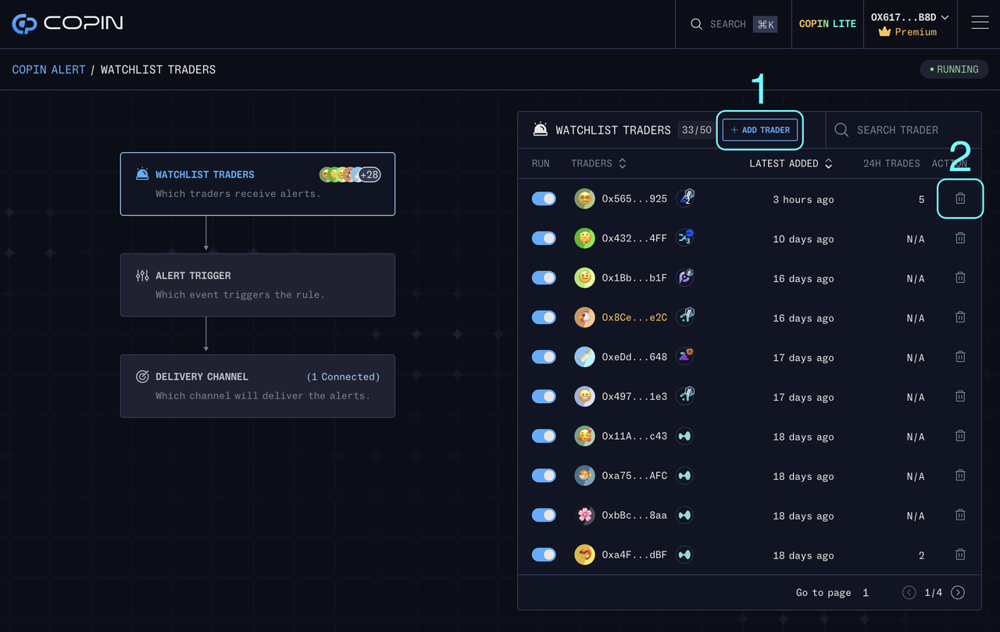

# Trader Profile

The trader profile page provides comprehensive statistics, including trading frequency, profit performance, and a detailed transaction history, allowing for a thorough analysis of the trader's trading activities and performance.

## Trader Profile

<figure><figcaption></figcaption></figure>

A dedicated Trader Profile is automatically generated for each wallet address engaging in trades on the perpetual DEX protocol. If you have traded on Polynomial, Kwenta, or GMX, paste your wallet address into the 'Search Address' to explore your trader profile. An on-chain trader profile on Copin now has 7 parts:&#x20;

\[1] - Percentile Ranking Radar Chart: Shows an overview of the trader's trading style based:

\[2] - The PnL profit fluctuation chart

\[3] - An overview of all opening positions&#x20;

\[4] - Positions chart&#x20;

\[5] - Stats&#x20;

\[6] - Trading frequency&#x20;

\[7] - Transaction history

***

### **\[1] - Percentile Ranking Radar Chart**

Shows an overview of the trader's trading style based:

* High Avg ROI
* High Avg Volume
* High Win Rate
* Low Max Drawdown
* Frequently Trade
* Quickly Settled

Besides the default radar chart with 6 fields above, you can also customize the radar chart to your style by changing other fields: High PnL, High Max ROI, Low Leverage, High Profit Rate, High PnL ratio, Low Overtrading.

**Compare / Find similar traders**

<figure><figcaption></figcaption></figure>

Ever stumbled upon a stellar trader on Copin but wished you could find others with similar strengths? Your wish is granted! Introducing Compare & Find, the latest feature on Copin Analyzer that takes your trader exploration to the next level.

<figure><figcaption></figcaption></figure>

* **Compare Traders:** Dive deep into visually comparing the trading strategies, performance metrics, and risk management approaches of two traders with two radar charts. Comparing direct balance, last trade, runtime, and markets side by side.&#x20;

<figure><figcaption></figcaption></figure>

Copin also brings you Percentile Ranking Comparison, allowing you to assess traders based on their percentile rankings. Compare and find traders who match your percentile criteria, adding an extra layer to your trading analysis!

* **Find Similar Traders (Premium)**: Looking for like-minded traders? Explore the new 'Find Similar Traders' feature to discover others who align with your trading preferences and style.

### **\[2] - The PnL profit fluctuation chart**

Displays the variation in profit and loss for a trader across different time periods. It helps in assessing the trader's ability to generate consistent profits and understanding the volatility of their trading strategy. Visualize the data as a **line chart** or **bar chart**, whichever suits your analysis needs. Additionally, you'll find essential details about traders:

* Balances: The current account balance of the trader
* Last trade: Most recent trade order
* Runtime: The period from the initiation of trading activity on the protocol until now

### **\[3]** - **Opening position**

Opening position refers to the display of the trader's current open positions. Once a trader closes a position, that position will be displayed below in the **History** section**\[4] - Positions chart:** Shows the history of price movement and position history (open, close, increase, decrease) on the body of the candlestick so that you can observe an overview of the trader's trading strategy.

### **\[4] - Positions chart**

Shows the history of price movement and position history (open, close, increase, decrease) on the body of the candlestick so that you can observe an overview of the trader's trading strategy.

<figure><figcaption></figcaption></figure>

Zoom the Candlestick Chart in for precision, switch between multiple time frames M5, M15, H1, H4, and D (1), and explore a variety of trader's trading pairs (2).

### **\[5]** - **Stats**

The detailed statistics of a trader's trading performance encompass various key metrics and time frames.

<figure><figcaption></figcaption></figure>

Feel empowered to tailor your trader evaluation using indicators, sorting options, and customized filters that align with your trading style and individual preferences 👇

### **\[6] - Trading frequency**

The heatmap activity feature is tucked away, waiting for you to discover it. When shown, it unveils the journey and consistency of traders.

<figure><figcaption></figcaption></figure>

The trader's trading frequency is categorized into five different levels, each represented by ascending color levels. This visualization provides a clear depiction of the trader's activity level, showcasing how frequently they engage in trading. The ascending color levels help illustrate the increasing intensity or frequency of the trader's trading activity.

### **\[7] - Transaction history**

The trader's transaction history includes important details such as the timestamp of each trade, entry price, trade size, leverage utilized, and the associated Profit and Loss (PnL) for each trade.

<figure><figcaption></figcaption></figure>

These details provide a comprehensive overview of the trader's trading activities, allowing for in-depth analysis of their entry points, trade sizes, risk management through leverage, and overall profitability.

## Position details

To view the detailed history of each position, simply click on the respective position. The position's history includes relevant information such as entry points, exit points, profit/loss, duration, and any associated transactions.

<figure><figcaption></figcaption></figure>

**\[1] - The position's profit and loss (PNL):** movement history displays the historical changes in PNL for the specific position. You can track the performance of the position over time, observe the fluctuations in its profitability, and gain insights into its overall financial performance.**\[2] - The history of the position:** encompasses the trading orders associated with it, including open, close, increase, decrease, and liquidated orders. This record provides a detailed overview of the position's lifecycle, highlighting the specific actions taken throughout its existence. By reviewing this history, you can understand the sequence of trading orders executed for the position, enabling a thorough analysis of its performance and management.

* _**Open**_: Initiate a new position by entering into a trade.
* _**Increase**_: Add to the volume (amount of money) of an existing position, also referred to as order stuffing or dollar-cost averaging (DCA).
* _**Decrease**_: Reduce the volume (amount of money) of an existing position, also known as position lock or cutting off.
* _**Close**_: Terminate or exit the position, resulting in the closure of the trade. The closing of the position includes the profit earned and the Return on Investment (ROI).
* _**Liquidated**_: The position has been forcefully closed by the exchange or platform, usually due to reaching a predetermined threshold or margin call, resulting in the liquidation of the position.

**\[3] - What If:** when you review a trader's profile, you can simulate the potential outcomes of holding positions longer. You can set it from 1 → 48 hours to evaluate if it's a good exit point.
